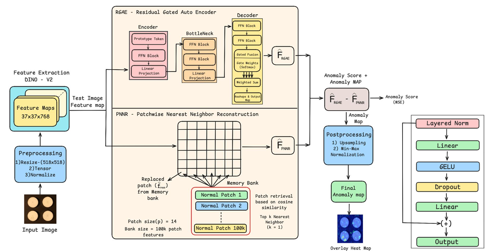
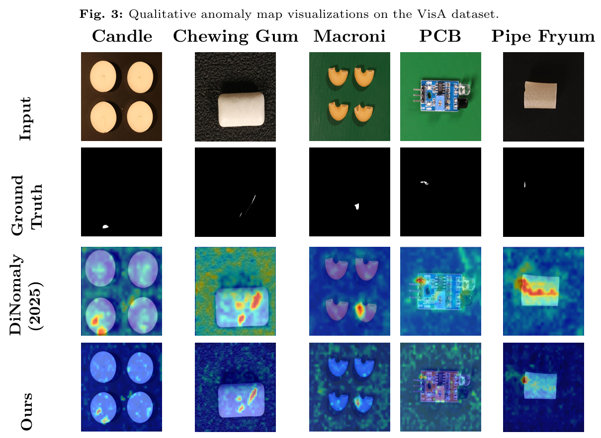
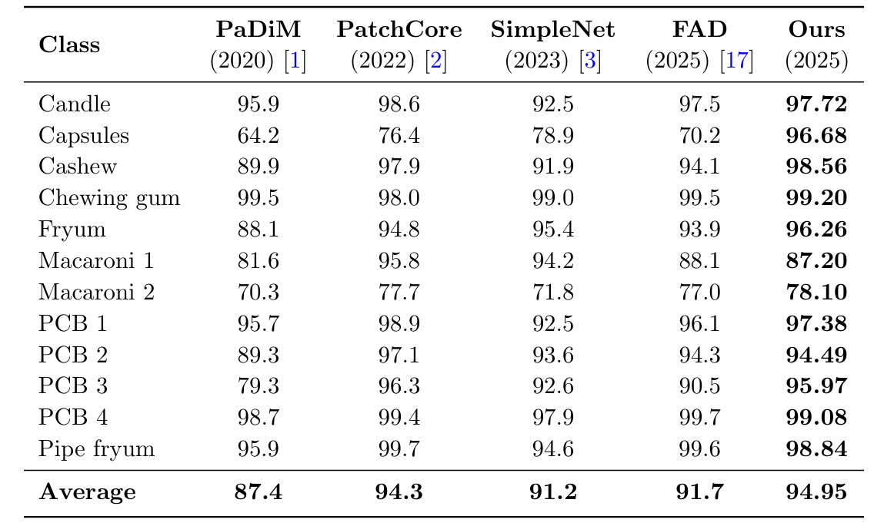

# RGAE-PNNR: Residual Gated Autoencoder for Anomaly Detection

This repository contains the official implementation of the paper **"Residual Gated AutoEncoder with Patchwise
Nearest Neighbor Reconstruction for Visual
Anomaly Detection"**.

Our method combines a **Residual Gated Autoencoder (RGAE)** with a **Patchwise Nearest Neighbor Reconstruction (PNNR)** memory bank to achieve robust unsupervised anomaly detection. It is designed to work effectively on the MVTec AD and VisA datasets and other similar AD datasets.

## Architecture: RGAE-PNNR
<p align="center">  </p> <p align="center"> <em>Overall architecture of the proposed Residual Gated Autoencoder with Patchwise Nearest Neighbor Reconstruction (RGAE-PNNR).</em> </p>

## Qualitative Results
### MVTec AD
<p align="center">  </p> <p align="center"> <em>Qualitative anomaly localization results on the MVTec AD dataset.</em> </p>

### VisA
<p align="center">  </p> <p align="center"> <em>Qualitative anomaly localization results on the VisA dataset.</em> </p>

## Quantitative Results (Tables)
### MVTec AD – Image-level & Pixel-level AUC
<p align="center">  </p> <p align="center"> <em>Quantitative comparison on the MVTec AD dataset in terms of image-level and pixel-level AUC.</em> </p>

### VisA – Image-level AUC
<p align="center">  </p> <p align="center"> <em>Quantitative comparison on the VisA dataset.</em> </p>

##  Project Structure

```text
.
├── data/                   # Dataset folder (Download MVTec AD here)
├── train.py                # Main training script
├── test.py                 # Evaluation script (Image & Pixel AUC)
├── heatmap.py              # Visualization script (Generates overlays)
├── requirements.txt        # Python dependencies
├── checkpoints/            # [Auto-generated] Saves trained models (.pth) and banks (.npy)
└── heatmaps/               # [Auto-generated] Saves visualization results
```
## Setup & Installation
1. Clone the Repository:
```
git clone [https://github.com/NithilanM23/RGAE-PNNR.git](https://github.com/NithilanM23/RGAE-PNNR.git)
cd RGAE-PNNR
```
2. Install Dependencies
```
pip install -r requirements.txt
```
3. Prepare the Dataset
This repository supports any anomaly detection dataset (MVTec AD, VisA, or your own) as long as it follows this standard folder structure:
**Official Download Links:**
* **MVTec AD:** [Download Here](https://www.mvtec.com/company/research/datasets/mvtec-ad)
* **VisA:** [Download Here](https://github.com/amazon-science/spot-diff)

Extract it into a data folder so the structure looks like this:

```
RGAE-PNNR/
└── data/
    ├── mvtec_ad/             <-- Dataset 1
    │   ├── bottle/
    │   ├── cable/
    │   └── ...
    │
    ├── visa/                 <-- Dataset 2 (Optional)
    │   ├── candle/
    │   ├── macaroni1/
    │   └── ...
    │

```
## Usage
1. Training
To train the model on a specific category (e.g., bottle). This will automatically create a checkpoints/ folder and save the model (.pth) and memory bank (.npy).
```
python train.py --data_root ./data/mvtec_ad --category bottle --epochs 50
```
Arguments:
```
--data_root: Path to the dataset root folder.

--category: The class name (e.g., bottle, hazelnut).

--epochs: Number of training epochs (default: 30).
```
2. Evaluation
To evaluate the trained model and calculate Image-level AUC and Pixel-level AUC.
```
python test.py --data_root ./data/mvtec_ad/bottle/test/bad --category candle --checkpoint_dir ./checkpoints
```
3. Visualization (Heatmaps)
To generate anomaly heatmaps overlayed on the test images. This will automatically create a heatmaps/ folder and save the images there.
```
python heatmap.py --data_path ./data/mvtec_ad/candle/test/bad --checkpoint_dir ./checkpoin
```

## License
This project is licensed under the MIT License.
